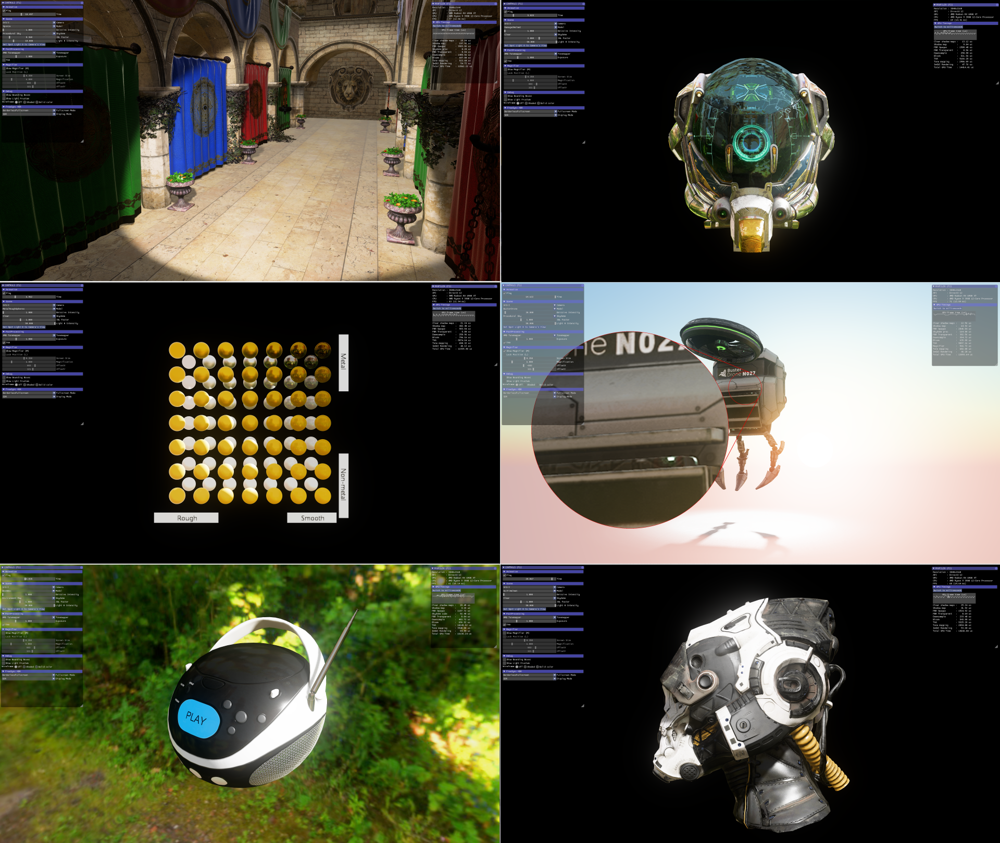

# glTFSample 

This is a fork of [glTFSample](https://github.com/GPUOpen-LibrariesAndSDKs/glTFSample), originally developed by AMD to show off the capabilities of the [Cauldron framework](https://github.com/GPUOpen-LibrariesAndSDKs/Cauldron).
This fork has been modified to serve as the CPU host app for sample shaders generated by the [Metashade glTF demo](https://github.com/ppenenko/metashade/tree/master/gltfdemo) in order to demonstrate [Metashade](https://github.com/ppenenko/metashade) in action.

The original [glTFSample](https://github.com/GPUOpen-LibrariesAndSDKs/glTFSample) uses the traditional ubershader/preprocessor approach for its scene/PBR pass shaders: HLSL for DX12 and GLSL for Vulkan. In this fork, the HLSL ubershader can be overridden with concrete shader permutations generated by the [Metashade glTF demo](https://github.com/ppenenko/metashade/tree/master/gltfdemo) per glTF material and mesh primitive. See [Command-line interface](#command-line-interface) for instructions.



# Build Instructions

Please note that the original [glTFSample](https://github.com/GPUOpen-LibrariesAndSDKs/glTFSample) generates separate VC++ solutions for DX12 and Vulkan, but this fork currently only supports DX12, the Vulkan solution can't be built.

### Prerequisites

To build glTFSample, you must first install the following tools:

- [CMake 3.4](https://cmake.org/download/)
- [Visual Studio 2017](https://visualstudio.microsoft.com/downloads/)
- [Windows 10 SDK 10.0.17763.0](https://developer.microsoft.com/en-us/windows/downloads/windows-10-sdk)
- [Vulkan SDK 1.1.106](https://www.lunarg.com/vulkan-sdk/) - not required by this fork.
- [boost](https://www.boost.org/) 1.75.0 or newer - only required by this fork. Boost is only used for convenience and is not required by Metashade itself.

### Build steps

1) Get the media files from the separate repo:
    ```
    > git clone https://github.com/GPUOpen-LibrariesAndSDKs/Cauldron-Media.git
    ```

2) In the same directory, clone this repo and branch together with the submodule of our [fork of the Cauldron framework](https://github.com/ppenenko/Cauldron)):
    ```
    > git clone https://github.com/ppenenko/glTFSample.git --recurse-submodules --branch metashade_demo
    ```

3) Generate the DX12-specific solution. Unlike the original [glTFSample](https://github.com/GPUOpen-LibrariesAndSDKs/glTFSample) which uses [GenerateSolutions.bat](build/GenerateSolutions.bat), we have to run CMake manually:
    ```
    > cd glTFSample\build
    > mkdir DX12
    > cd DX12
    > cmake ..\.. -DGFX_API=DX12 -DBOOST_ROOT=C:\path\to\boost\boost_1_75_0
    ```

4) Build the generated solution.

# Command-line interface

```
--metashade-out-dir Path to the output directory of the Metashade generator.
--dx12-validation   Enable DX12 debug validation.
```

To start the app with shaders generated by the [Metashade glTF demo](https://github.com/ppenenko/metashade/tree/master/gltfdemo), point `--metashade-out-dir` at its output directory. If `--metashade-out-dir` is omitted, the original HLSL ubershader is used for rendering, which can be used as a reference during debugging.
