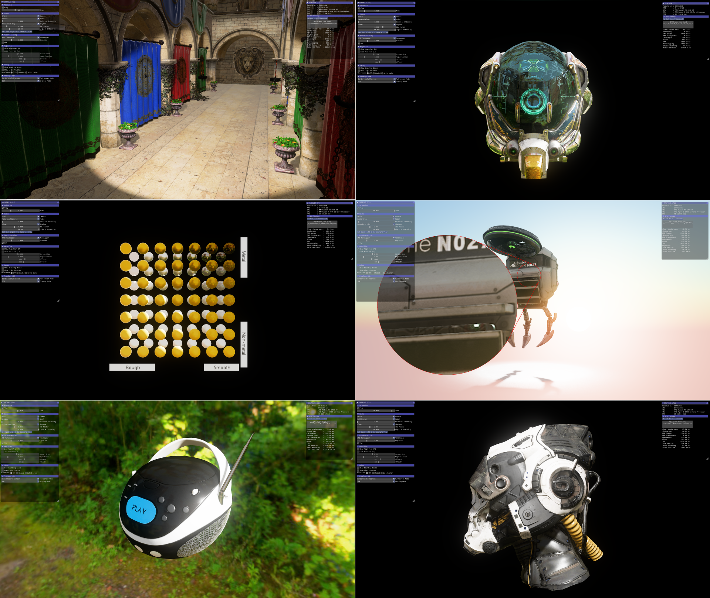

# glTFSample 

This is a fork of [glTFSample](https://github.com/GPUOpen-LibrariesAndSDKs/glTFSample), originally developed by AMD to show off the capabilities of the [Cauldron framework](https://github.com/GPUOpen-LibrariesAndSDKs/Cauldron).

This fork serves as the **C++ host application** for sample shaders generated by [metashade-glTFSample](https://github.com/metashade/metashade-glTFSample), demonstrating [Metashade](https://github.com/metashade/metashade) in action.

**This repo is a submodule of [metashade-glTFSample](https://github.com/metashade/metashade-glTFSample).** See the parent repo for build instructions.

The original glTFSample uses the traditional ubershader/preprocessor approach for its scene/PBR pass shaders. In this fork, the HLSL ubershader can be overridden with concrete shader permutations generated by metashade-glTFSample per glTF material and mesh primitive.



## Command-line interface

```
--metashade-out-dir  Path to the output directory of the Metashade generator.
```

To use shaders generated by metashade-glTFSample, point `--metashade-out-dir` at the output directory. If omitted, the original HLSL ubershader is used for rendering.
